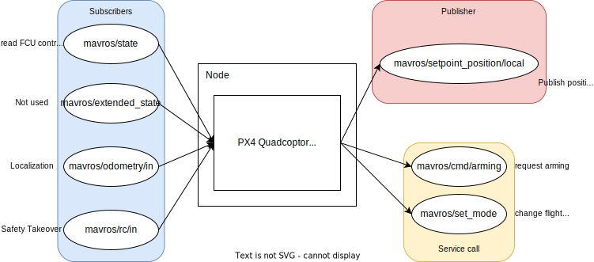
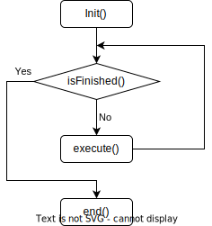

# PX4 Quadcopter Node

The quadcopter node class provides easy modularization to the quadcopter's task and handles take-off, landing, and safety takeover functionality easily. 

In this node, your custom code is packaged as a ```Command``` class. Multiple commands can be loaded to the drone and the drone will execute them sequentially. For example, you can create a linear move command and load it 4 times to create a square path. See ```Offboard``` section for more details. 

## Class topics
All topics subscribed/published/called is from the mavros package. Their functionality is listed below:



## Overall structure
The quadcopter is packaged into a class ```PX4Quadcopter``` and is intended to be used as follows:

In an node source file, caller should:
- create a PX4Quadcopter object
- add commands to the object
- maintain a while loop at a certain rate and call the object's ```execute()``` function.


Every call to the ```execute()``` function steps the state machine and sends a target pose through mavros to PX4 controller. In other words, target pose is constantly sent to the controller, the user modifies what to send. All such modification should be through the ```setTargetPose()``` function.

## State Machine Sequence

This node uses a state machine framework to implement the PX4 takeoff sequence along with other features such as initial pose recording and safety takeover check. 


### Disconnected

In this state we wait for PX4 to connect through the ```mavros/state``` topic. 

### Check Throttle

This state ensures the human operator's throttle is set at about ```50%``` of the full throttle. This is a safety check for possible remote takeover, see "safety" for more details.  

### Receive Orientation

This state will receive initial orientation and save its **Z rotation component only** , so that all pose target commands are relative to this local frame. i.e. no matter which direction you put the drone relative to earth's magnetic field, a identity rotation target will maintain the drone's heading.

In this stage, takeoff target will be set for "switching mode". **If you want to modify takeoff pose, do it here** 

### Switch Mode

Given continuous takeoff target stream by the previous state, the rosservice ```mavros/set_mode``` is called to change flight mode to ```OFFBOARD```. 

### Arming

Rosservice ```mavros/cmd/arming``` is called to arm the drone.  

### Offboard Controlled

This mode is where your custom code is running. As said, your custom code is packaged as ```Command``` objects. The drone will execute loaded commands one-by-one. When there's no commands to execute, the drone will advance to auto land mode. 

### Auto Land
Rosservice ```mavros/set_mode``` is called to change flight mode to ```AUTO.LAND```. The drone will land vertically. 

## Command Structure
If you are ever a FRC programmer, you should be very familiar with this. A Command is a structure for implementing your mission. It have 4 blanks for you to fill in: 



For example, a ```wait``` command can be implemented by:

- init(): start_time = ros::Time::now()
- isFinished(): return ros::Time::now() - start_time < 1.0
- execute(): empty
- end(): empty

See the ```commands``` folder for more examples.  

## Safety Takeover
When something went wrong with localization or our control program, we need to have manual control over the drone. ***safety takeover is done by:***

- Takeoff with mode switching lever ***NOT*** in ```manual``` or ```stabilized``` mode. 
- Put your throttle stick to around ```60%``` to prepare for safety takeover
- Run the control node. Just in case something went wrong, then: 
- switch the mode switching lever to ```manual``` or ```stabilized``` mode. Doing so will generate change the flight mode into stabilized (since the PX4Quadcopter class will not constantly change mode to ```offboard```). 

In that situation, the throttle stick's position will be interpreted as throttle power immediately after switching mode. ***If the throttle stick is at some low position (say, all the way bottom, which indicates no throttle), the drone will immediately fall to the ground.*** The safety check state that ensures around ```60%``` throttle prepares you for this takeover. 

## Examples:
offb_node2.cpp
```
#include <ros/ros.h>

#include "PX4_quadcoptor.hpp"
#include "commands/delay.hpp"
#include "commands/wait_height_stable.hpp"
#include "commands/circle.hpp"
#include "commands/linear_move.hpp"


int main(int argc, char **argv) {

    ERLControl::PX4Quadcoptor quad;
    quad.addCommand(std::make_unique<ERLControl::WaitHeightStableCommand>(0.05));
    quad.addCommand(std::make_unique<ERLControl::DelayCommand>(3.0));
    quad.addCommand(std::make_unique<ERLControl::MoveCommand>(Eigen::Vector3d(0,0,0.8), 4, 0.05));

    quad.initNode(argc, argv, "px4_quad");

    ROS_WARN("======Node initialized======\n");

    ros::Rate loopRate(50);

    while (ros::ok() && !quad.isRemoteTakeover() && !quad.isShutdown()){
        quad.execute();
        loopRate.sleep();
    }
    
    return 0;
}
```


Linear move command
``` 
#ifndef ERL_CONTROL_MOVE_HPP
#define ERL_CONTROL_MOVE_HPP

#include <ros/ros.h>
#include "../command.hpp"
#include "math.h"

#include "../PX4_quadcoptor.hpp"

#include <geometry_msgs/Vector3.h>
#include <geometry_msgs/Pose.h>

#include <sophus/se3.hpp>
#include <sophus/interpolate.hpp>

namespace ERLControl{

    class MoveCommand : public Command {
        public:
        MoveCommand(Sophus::Vector3d aTarget, double aMoveTime, double aTolerance, double aTimeout = 10.0) :
         target(aTarget), move_time(aMoveTime), tolerance(aTolerance), timeout(aTimeout) {}

        void initialize() override {
            start_time = ros::Time::now();
            start_pose = quad->getLocalPose();

            target_pose.translation() = target;
            target_pose.setQuaternion(start_pose.unit_quaternion());
        }

        void execute() override {
            
            auto t = (ros::Time::now() - start_time).toSec();
            double p = t / move_time;

            if (p >= 1.0) {p = 1.0;}

            Sophus::SE3d current_target_local = Sophus::interpolate(start_pose, target_pose, p);

            quad->setTargetPose(current_target_local);
        }

        bool isFinished() override {
            double delta2 = 0;
            auto currentPose = quad->getLocalPose();

            Sophus::Vector3d diff = (currentPose.translation() - target_pose.translation());

            return (diff.norm() < tolerance) || (ros::Time::now() - start_time) > ros::Duration(timeout);
        };

        std::string getName() override {
            return "move";
        }

        private:
        Sophus::Vector3d        target;
        double                  tolerance;
        double                  move_time;
        double                  timeout;

        ros::Time               start_time;
        Sophus::SE3d            start_pose;
        Sophus::SE3d            target_pose;
    };

}

#endif
```